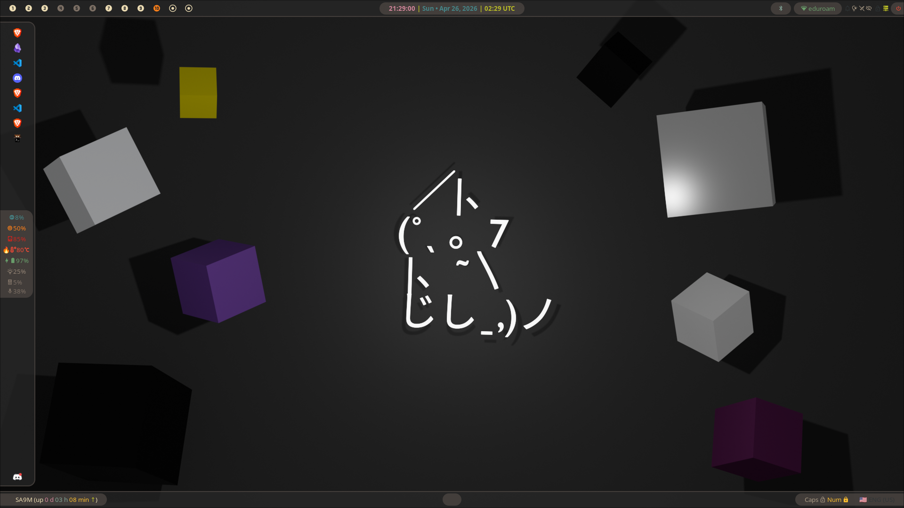
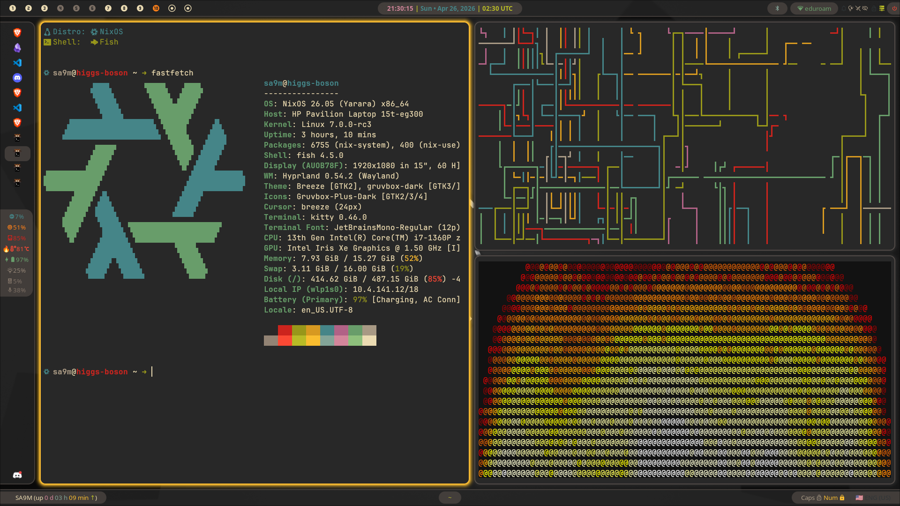
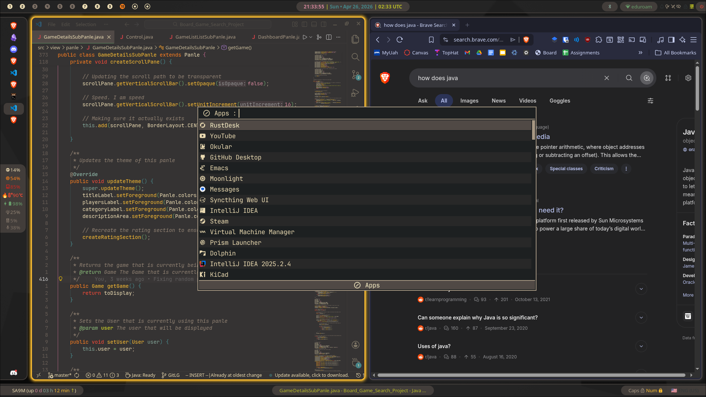

# My Personal NixOS Configuration and a Simple NixOS Beginner Guide
Welcome to my definitely totally fantastic and not at all randomly pieced together NixOS Configuration! :D
I am planning to use this repository for two purposes: to host my nixos configuration and to act as a simple beginner friendly tutorial for transitioning to NixOS.

## Images






## Table of Contents
- [Credits](#credits)
- [Tech Stack](#tech-stack)
  - [Core Operating System](#core-operating-system)
  - [Desktop Environments](#desktop-environments)
  - [Hyprland Ecosystem](#hyprland-ecosystem)
  - [Terminal & Shell](#terminal--shell)
  - [Networking & VPN](#networking--vpn)
  - [Web Browsing](#web-browsing)
  - [Storage & Syncing](#storage--syncing)
  - [Remote Access](#remote-access)
  - [Hardware & Peripherals](#hardware--peripherals)
  - [Development & Virtualization](#development--virtualization)
  - [Theming & Appearance](#theming--appearance)
- [Prerequisites for NixOS Installation](#prerequisites-for-nixos-installation)
- [NixOS Installation](#nixos-installation)
  - [1. Boot from your USB](#1-boot-from-your-usb)
  - [2. Connect to the Internet](#2-connect-to-the-internet)
  - [3. Run the Installer](#3-run-the-installer)
- [Configuration Installation](#configuration-installation)
  - [Cloning this Repository](#cloning-this-repository)
    - [1. Backup your hardware configuration](#1-backup-your-hardware-configuration)
    - [2. Clear your configuration directory](#2-clear-your-configuration-directory)
    - [3. Clone this Repository](#3-clone-this-repository)
    - [4. Restore your hardware configuration](#4-restore-your-hardware-configuration)
    - [5. Ensure the correct permissions](#5-ensure-the-correct-permissions)
  - [Preparing your new configuration for use](#preparing-your-new-configuration-for-use)
    - [1. Update the Username](#1-update-the-username)
    - [2. Update your Hostname](#2-update-your-hostname)
    - [3. Perform the Initial Build](#3-perform-the-initial-build)
  - [Updating the nrs command](#updating-the-nrs-command)
    - [Point Git to your own repository](#point-git-to-your-own-repository)
    - [Remove the GitHub sync](#remove-the-github-sync)
- [Using Your New Configuration](#using-your-new-configuration)
- [Keyboard Shortcuts](#keyboard-shortcuts)
  - [Core Window Management](#core-window-management)
  - [Launching Applications](#launching-applications)
  - [Special Workspaces](#special-workspaces)
  - [Utilities & System Toggles](#utilities--system-toggles)
  - [Media Controls](#media-controls)
- [Updates and Changes to Your Configuration](#updates-and-changes-to-your-configuration)
  - [Adding Systemwide Programs](#adding-systemwide-programs)
  - [Garbage Collection (Freeing up Disk Space)](#garbage-collection-freeing-up-disk-space)
  - [Rolling Back](#rolling-back)
  - [Understanding The Config Structure](#understanding-the-config-structure)


## Credits
Before we get any further into this readme, I would like to give credit to the XNM1 for [their configuration](https://github.com/XNM1/linux-nixos-hyprland-config-dotfiles) that I used as a base for mine. 

## Tech Stack

### Core Operating System
| Software / Tool | Description / Role |
| :--- | :--- |
| **NixOS** | The foundational declarative operating system. |
| **Flakes & Home Manager** | Tools used to manage system reproducibility and user-specific configurations declaratively. |
| **GRUB** | The bootloader, specifically configured with a Minecraft-style theme (`minegrub`). |

### Desktop Environments
| Software / Tool | Description / Role |
| :--- | :--- |
| **Hyprland** | The primary, dynamic tiling Wayland compositor. |
| **KDE Plasma** | A traditional desktop environment configured as a reliable fallback. (note I don't often use this, so there could be issues with it) |

### Hyprland Ecosystem
| Software / Tool | Description / Role |
| :--- | :--- |
| **Waybar** | Highly customizable status bar for Wayland. |
| **Rofi** | Application launcher and search utility. |
| **Dunst** | Lightweight desktop notification daemon. |
| **Wlogout** | Wayland-based logout and power management menu. |
| **Hyprpaper / Hyprlock / Hypridle** | Wallpaper management, screen locking, and idle management natively built for Hyprland. |

### Terminal & Shell
| Software / Tool | Description / Role |
| :--- | :--- |
| **Kitty** | The default, GPU-accelerated terminal emulator. |
| **Fish** | The default user shell, featuring robust auto-completion and syntax highlighting. |
| **Starship** | Fast, highly customizable cross-shell prompt. |
| **Atuin** | Magical shell history sync and search tool via an SQLite database. |

### Networking & VPN
| Software / Tool | Description / Role |
| :--- | :--- |
| **NordVPN / Wgnord** | VPN integration explicitly using WireGuard via the wgnord utility. |

### Web Browsing
| Software / Tool | Description / Role |
| :--- | :--- |
| **Brave** | A great browser with built in ad blocking (no YouTube ads) |


### Storage & Syncing
| Software / Tool | Description / Role |
| :--- | :--- |
| **Syncthing** | Continuous file synchronization across devices (e.g., syncing Obsidian vaults). |
| **Rclone / Google Drive** | Tools for mounting and syncing remote cloud storage directly to the file system. |

### Remote Access
| Software / Tool | Description / Role |
| :--- | :--- |
| **Sunshine & Moonlight** | Host and client applications for high-performance, low-latency remote desktop and game streaming. |
| **RustDesk** | Fantastic remote desktop software, but does not allow you to remote into a NixOS computer. Because I dual boot, I can reboot my PC into Windows and use RustDesk to remote into it if I need to. |

### Hardware & Peripherals
| Software / Tool | Description / Role |
| :--- | :--- |
| **OpenRGB** | Open-source software for controlling RGB lighting across different hardware components. |
| **Plover** | Open-source stenography engine for writing at the speed of thought. |
| **Droidcam** | Utility to use a smartphone as a wireless webcam for the PC. |

### Development & Virtualization
| Software / Tool | Description / Role |
| :--- | :--- |
| **Virtual Machines** | Configured QEMU/KVM modules for virtualization and safe sandboxing. |
| **PlatformIO** | Ecosystem for embedded development. |
| **Nix-Alien** | Utility to run unpatched binaries and AppImages on NixOS seamlessly. |
| **Neovim** | Highly customized modal terminal editor. |
| **Doom Emacs** | Configuration framework for GNU Emacs tailored for speed and Vim keybindings. |
| **VS Code / IntelliJ** | Supported GUI-based code editors with custom window rules for Hyprland integration. |

### Theming & Appearance
| Software / Tool | Description / Role |
| :--- | :--- |
| **Catppuccin & Gruvbox** | Cohesive, warm color palettes applied across the system and terminals. |
| **JetBrains Mono Nerd Font** | Primary typography used for clear code legibility and UI icon rendering. |


## Prerequisites for NixOS Installation
Before getting into the installation, you will need to have a few things ready.
* **A USB flash drive** to use as your installation medium. It doesn't need to be huge, around 8 gigabytes should work.
* **The [NixOS Graphical ISO](https://nixos.org/download/).** I highly recommend downloading the KDE Plasma or GNOME version, they provide simple installers to use so that you don't have to download it from the commandline.
* **An internet connection.** A wired ethernet connection is easiest during installation, but Wi-Fi works too, just configure it in the live environment.
* **A flashing tool** like [Rufus](https://rufus.ie/en/) or [BalenaEtcher](https://etcher.balena.io/) to write the ISO onto your USB drive.

## NixOS Installation
This is where I guide you through installing NixOS onto your system. 
If you already have NixOS installed onto your system and you just want to try out my configuration, then feel free to jump over to [Configuration Installation](#configuration-installation).

### 1. Boot from your USB

The first thing you need to do is actually enter the live environment on your USB drive. To do that, simply plug the USB drive into your computer, restart, and enter the BIOS(you can enter the BIOS by repeated pressing a key on your keyboard. It varies with motherboards and keyboards, but usually is escape or f11). From the BIOS you should be able to find a boot menu where you can select the USB.

### 2. Connect to the Internet

Once you are in the live environment, you are going to want to connect to the internet so that you can download and install the operating system. To do that, you can either simply connect an ethernet cable or click the network icon in the system tray and select the Wi-Fi that you are connecting to.

### 3. Run the Installer

Click the "Install NixOS" icon on the desktop to launch the graphical intaller. The installer will give you a lot of prompts to do things like select your language, timezone, and keyboard layout and then ask you which desktop environment to install. For the desktop environment, really any of them will work, but I will bring you through using Plasma (KDE), so you should select that one. It will then ask you to allow unfree software. For this configuration, you will need to allow unfree software because a lot of the software used in this configuration is unfree. 

Let the installer partition your drive (be careful here to select the drive that you want NixOS on, because it completely wipes the partition it uses) and then install the system. Once it finished, you can remove the USB drive and you will boot into your new NixOS installation!

## Configuration Installation
This is where I guide you through actually installing and using the files that I have in this repository to make your NixOS configuration look like mine.
This repository has two configurations, one for a laptop and one for a desktop. While they share many modules and configs, they are distinct in a few ways (for example, I have a remote gaming hosting software run on my desktop but not my laptop so that I can remotely game).

These installation instructions are specifically for `gluon`, my desktop configuration. If you want to install `higgs-boson`, my laptop configuration, then you can simply change `gluon` to `higgs-boson` in all of the commands that we will run. \(Yes, I am a nerd and my devices are named after subatomic particles\)
Alternatively, if you want to set up both a laptop and a desktop configuration, you can just rerun each command \(other than cloning the repository\)

### Cloning this Repository
The first thing that you need to do is clone this repository so that you actually have the files to build from. 
Before you do any cloning though, figure out where you want your configuration to live. I keep mine in the default `/etc/nixos` folder, and that is where the `nrs` shortcut to rebuild assume your files are, so that's where this guide will install them for you. 
This also assumes that you have a fresh NixOS install with your `hardware-configuration.nix` in at `/etc/nixos`, if you don't have one generated yet, you will need to generate it by running `sudo nixos-generate-config --dir /etc/nixos`. 

There are a few steps involved in this:
#### 1. Backup your hardware configuration

NixOS stores the information for how the system should interact with the hardware in a file called `hardware-configuration.nix`. If you have different hardware to the hardware I am running, which is highly likely, my `hardware-configuration.nix` will not work for you. So, we need to backup your `hardware-configuration.nix`, which we can do with 
```
cp /etc/nixos/hardware-configuration.nix ~/hardware-configuration.nix.bak
``` 
#### 2. Clear your configuration directory

Next up, we need to clear out the directory so that Git doesn't get unhappy when we clone this repo. To do this, we have to run a remove command from the commandline. As a side note, this is a fantastic time to remind you to only run commands that you trust. This next command, `sudo rm -rf`, has the ability to recursively force the removal of files from your computer. We are only using it to remove what is in your `/etc/nixos` folder \(which is what the `/etc/nixos/*` is in the command\), so you can safely run it. 
```
sudo rm -rf /etc/nixos/*
``` 

#### 3. Clone this Repository

    Now, you can pull down all of the files from GitHub to your computer.
```
sudo git clone https://github.com/intentionalDisaster99/NixOS.git /etc/nixos
```

#### 4. Restore your hardware configuration

Now that you have everything downloaded, you can put your `hardware-configuration.nix` back in place. You can do this the same way that we backed it up before, with a `cp`\(copy\) command:
```
sudo cp ~/hardware-configuration.nix.bak /etc/nixos/hosts/gluon/hardware-configuration.nix
```

#### 5. Ensure the correct permissions

We used `sudo` to clone and copy files to make sure that they were successfully cloned and copied, so we need to make sure that your user owns the files. This allows you to edit them freely for when you want to update your configuration later on. We can do a simple `chown` for this:
```
sudo chown -R $USER:users /etc/nixos
```

### Preparing your new configuration for use
Now that you have the configuration cloned and set up for your hardware, we need to update the users and get set up to load it for the first time.

Because this configuration is tailored to my personal setup, it expects my username (sa9m) and my desktop's hostname (gluon). Before applying the system switch, you need to swap these out for your own so that your home directory sets up correctly and you aren't locked out of your own machine.

#### 1. Update the Username

To change the username, you need to change the configuration files, so you'll have to open the files in your favorite text editor\(If this is a fresh instlal, you can use `nano path-to-file-to-edit`\). You need to change the default username in two places:
 - In `hosts/gluon/configuration.nix`, you need to change `users.users = { sa9m = { ... } }` block. Change sa9m to your username.
 - In `flake.nix`, look for the gluon configuration block and find `home-manager.users.sa9m`. Change sa9m to your username here as well.

#### 2. Update your Hostname:

NixOS flakes, which is how this config is set up, uses the hostname to determine which profile to build. As I said, my hostnames are based on subatomic particles, so my laptop is `higgs-boson` and my desktop is `gluon`.
If you are a nerd like me and want to keep these hostnames, you can just skip this step.

If you do want to change the hostname, there are a few things that you need to change:
 - In `flake.nix`, find the line that says `nixosConfigurations.gluon` and update "gluon" to whatever you would like your hostname to be. 
 - In `hosts/gluon/configuration.nix` update `networking.hostName = "gluon";` to say whatever hostname you decided on.

#### 3. Perform the Initial Build:
Now that your hardware, user, and hostname are aligned, you can do the first actual rebuild to apply the system!
```
sudo nixos-rebuild switch --flake /etc/nixos#gluon
```
\(If you changed the hostname in step 2, replace `#gluon` with your new hostname\).


### Updating the `nrs` command
Included in this repository is a custom bash script located at `scripts/nrs.sh`. This script acts as a powerful shortcut that automatically formats your Nix files, commits any changes to Git, pushes them to the cloud for backup, and rebuilds the system with a clean output monitor.

However, if you try to run it immediately, it will fail. This is because the script runs git push, which will attempt to push your local changes back to my GitHub repository, where you do not have write permissions. To fix this, you have two options: use your own repository or remove the GitHub sync.


#### Point Git to your own repository
This is what I would recommend, because it means that you will have a backup of your system configuration so if you accidentally break something or get a new device, you can easily get everything set up again.

1. Create a new, empty git repository on your personal GitHub account.

2. Tell Git to use your new repository instead of my repository. You can do this with this group of commands:

```
cd /etc/nixos
sudo git remote set-url origin https://github.com/YourUsername/YourNewRepoName.git
sudo git push -u origin main
```

Now, every time you run the nrs script, it will safely back up your configuration to your own GitHub repository.

#### Remove the GitHub sync
If you only want to track changes locally on your machine and don't care about GitHub backups, you can simply remove the push command from the script.

1. Open `/etc/nixos/scripts/nrs.sh` in your text editor.

2. Scroll down and delete or comment out the git push line.

---

## Using Your New Configuration

## Keyboard Shortcuts
The fastest way to do stuff is by keeping your fingers on the keyboard, so I have a bunch of keyboard shortcuts set up. Don't worry if you don't want to worry about keyboard shortcuts, though, you can use your mouse too.

Note that the `SUPER` key I talk about is the windows key on most keyboards. 

### Core Window Management
* **`SUPER + Shift + Q`**: Close the active window
* **`SUPER + Shift + F`**: Toggle floating for the active window
* **`SUPER + Ctrl + F`**: Toggle fullscreen
* **`SUPER + Arrow Keys`** (or **`H, J, K, L`**): Move focus between open windows
* **`SUPER + 1-0`**: Switch to workspace 1-10
* **`SUPER + Shift + 1-0`**: Move the active window to workspace 1-10
* **`SUPER + Mouse Scroll`** (or **`< / >`**): Cycle through open workspaces
* **`SUPER + Left Click & Drag`**: Move a floating window
* **`SUPER + Right Click & Drag`**: Resize a floating window

### Launching Applications
* **`ALT + Space`**: Open the application launcher (Rofi)
* **`SUPER + T`**: Open Terminal (Kitty)
* **`SUPER + B`**: Open Web Browser (Brave)
* **`SUPER + E`**: Open File Manager (Dolphin)
* **`SUPER + I`**: Open Code Editor (VS Code)
* **`SUPER + N`**: Open Notes (Obsidian)
* **`SUPER + G`**: Open Steam

### Special Workspaces 
These shortcuts open applications in a hidden "special" workspace that drops down over your current screen, letting you quickly check them and hide them again.
* **`SUPER + S`**: Toggle Spotify 
* **`SUPER + D`**: Toggle Discord 
* **`SUPER + M`**: Toggle Google Messages 
* **`SUPER + K`**: Toggle Calculator
* **`SUPER + O`**: Toggle a hidden dropdown terminal

### Utilities & System Toggles
* **`SUPER + L`**: Lock the screen
* **`SUPER + Esc`**: Open the Power/Logout menu
* **`SUPER + Shift + S`**: Select an area to screenshot and copy to clipboard
* **`SUPER + Shift + E`**: Select an area to screenshot and open in the image editor (Swappy)
* **`SUPER + V`**: Open clipboard history to paste previous items
* **`SUPER + C`**: Open color picker
* **`SUPER + W`**: Cycle the wallpaper to being video or not
* **`SUPER + U`**: Toggle NordVPN (Wireguard)
* **`SUPER + P`**: Toggle power saving mode (though it doesn't currently do much)
* **`SUPER + Shift + N`**: Pause/Unpause desktop notifications
* **`SUPER + Shift + A`**: Toggle Airplane Mode
* **`SUPER + Shift + Y`**: Toggle Bluetooth
* **`SUPER + Shift + W`**: Toggle Wi-Fi

### Media Controls
* **`SUPER + Ctrl + P`**: Play/Pause media
* **`SUPER + ]`**: Next track
* **`SUPER + [`**: Previous track


### Updates and Changes to Your Configuration

#### Adding Systemwide Programs

One of the biggest mental shifts when transitioning to NixOS is realizing you don't use commands like `apt install` or `pacman -S`. Instead, you add the package name to a configuration file, rebuild the system, and it will install it for you.

To keep things organized and prevent a single massive configuration file, I use a specific module for enabling system-wide programs located at `modules/programs/packages.nix`. 

If you open `/etc/nixos/modules/programs/packages.nix`, you will see a list of packages organized by category (like "OS Utils", "Hyprland", "Terminal stuff", and "General Apps"). These define what are installed on the system.

To add a new program to your computer:

1. Search for the exact package name on the [NixOS Search page](https://search.nixos.org/packages). Let's say you want to install the GIMP image editor. You can search for "gimp" on the NixOS search page, you will find that the package name is simply `gimp` (not all of them will match up perfectly like this, so if you can't find a program it is a good idea to search for it).

2. Open the packages module in your favorite text editor, here I'll be using nano: 

```bash
sudo nano /etc/nixos/modules/programs/packages.nix
```
3. Scroll down to an appropriate category block (like the # General Apps section) and type `gimp` on a new line. Make sure it stays within the main square brackets [ ... ] that contain all the packages.

4. Save and exit the file. (ctrl + s then ctrl + x in nano)

5. Rebuild your system using our custom script by running `nrs` in your terminal (or `sudo nixos-rebuild switch --flake /etc/nixos#gluon` if you skipped the script setup).

Once the build finishes, that program is now downloaded and ready for you to use!

#### Garbage Collection (Freeing up Disk Space)
One of the quirks of NixOS is that it never deletes your old packages when you update or rebuild. It keeps them safely stored away so you can always roll back if something breaks or you want to use an old config without changing your configuration again. The only issue with this is that it takes up a lot of disk space.

When you are happy with your current system build and want to free up space by deleting all your old, unused system states, run the garbage collector:

```
sudo nix-collect-garbage -d
```

Note: This will delete your old boot menu options, so make sure your current system is stable before running this!

If you want to keep some of your old packages, but also want to free up some space, you can run the garbage collected with a specified cutoff for deleting old programs:
```
sudo nix-collect-garbage --delete-older-than 30d
```
The above command deletes everything older than 30 days old, so you can still roll back to about the last month with this command.

#### Rolling Back
As I said in the [Garbage Collection](#garbage-collection), NixOS saves your old configurations so that you can roll back to them whenever you want to. If something breaks or you update a program and it starts crashing, you can simply roll back to a state where it works. 

To roll back to an older "Generation", as NixOS calls them, you can simply restart your computer and when the GRUB boot menu shows up (if you have applied my configuration, it will be Minecraft themed) you will see a NixOS generations option. When you navagate down to it with your keyboard and hit enter, it will show you every generation that you have saved to your computer. Select one and your computer will boot into that configuration.


#### Understanding The Config Structure
A large part of being able to update and modify the configuration to your liking is understanding everything that is in the config. 
At the most basic level, here is the structure of my configuration:


`flake.nix`: The master entry point of the entire system. This file defines where NixOS gets its packages (the inputs) and defines the specific machines you can build (the outputs, like gluon and higgs-boson). It links all the other folders together.

`home.nix`: The master entry point for Home Manager. While `flake.nix` builds the underlying computer and system services, `home.nix` builds your user environment. It dictates which personal packages you have installed and acts as the bridge connecting your user profile to all of your custom dotfiles.

`/hosts/`: This directory contains folders for specific, physical computers. Inside, you will find files like hardware-configuration.nix (which tells NixOS about your specific motherboards, drives, and kernel modules) and configuration.nix (which defines the user accounts and hostnames for that specific machine).

`/modules/`: This is the core of the setup. Instead of having one massive, unreadable configuration file, everything is broken down into modular chunks based on purpose. If you want to change VPN settings, you look in `modules/nordvpn/`. If you want to change what fonts are installed, look in `modules/theme/fonts.nix`. This keeps the system organized.

`/dotfiles/`: While the rest of the configuration handles system-level stuff (like firewalls and display managers), this folder handles user-level application settings managed through a tool called Home Manager. This is where you will find the specific configuration files for applications like Hyprland, Waybar, the Fish shell, and the Kitty terminal.

`/scripts/`: A small folder containing useful bash scripts to make managing the system easier, such as the `nrs.sh` auto-rebuild script.

## Other Resources
There are lots of other great resources from the NixOS community, so for more information go check them out!

### Official Documentation
- [NixOS Manual](http://nixos.org/manual/nixos/stable/)
- [Nixpkgs Reference Manual](http://nixos.org/nixpkgs/manual/)
- [Home Manager Manual](https://nix-community.github.io/home-manager/)
- [NixOS Wiki - Installation Guide](http://wiki.nixos.org/wiki/NixOS_Installation_Guide)
- [NixOS Wiki Home](http://wiki.nixos.org/wiki/NixOS_Wiki)

### Community and Learning Resources
- [Awesome Nix List](http://nix-community.github.io/awesome-nix/)
- [Learn Nix](http://nixos.org/learn/)

